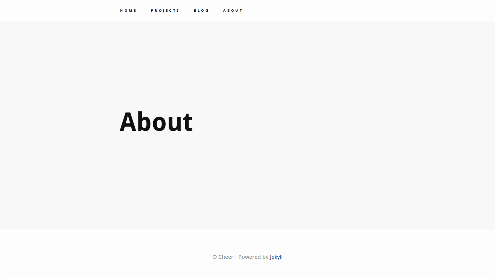

# Cheer
### A theme for Jekyll personal websites
Cheer is a minimal text-based theme for personal sites.

## Page Structure
It includes four pages - home, about, projects and blog. There is no site-name as such as this is aimed at being a personal site theme. 

## CSS
Some CSS was borrowed from the Whiteglass theme. The site looks beautiful on mobile. Contents have a good flow to them. 

## Customizability
This theme is fully customizable. See customizing.md for info on how to change layouts, add pages, add content etc.

## Demo

Cheers! :)
